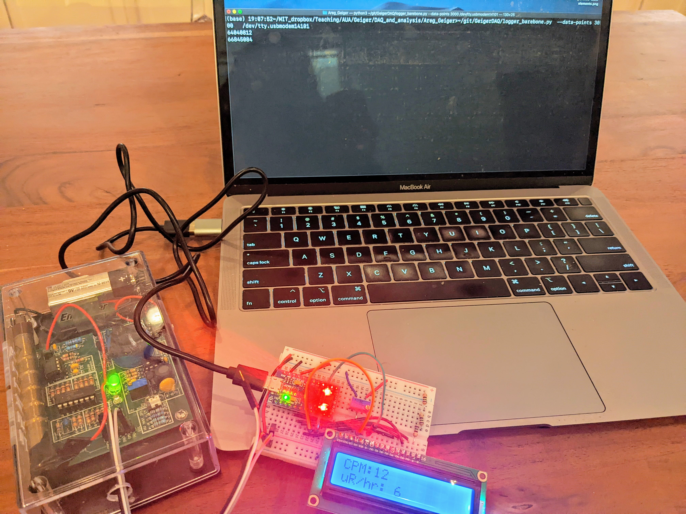

# GeigerDAQ

__Authors__:  Areg Hovhannisyan (areg_hovhannisyan@edu.aua.am ), Areg Danagoulian (aregjan@mit.edu)

__License and Copyright__: see individual files

This is a suite of various codes necessary for reading out the TTL signal from a typical Geiger-Muller detector by an Arduino microprocessor.  
The suite consists of two types of codes:

 * Arduino codes for detecting the TTL pulse, and transfering the timestamp of the pulse to the computer over the serial protocol
 * Python codes for reading in the serial data from the Arduino
 * readout from the microphone signal
 * code for ROOT, for reading in data and analyzing its time distribution

 More specific information:

 * requirements.txt -- Requirements for running the Python scripts
 * requirements_rpi.txt -- Requirements for running the logger_GPIO.py file (on a Raspberry Pi)
 * logger.py -- reads data from the serial bus, performs analysis, writes to a file
 * logger\_barebone.py -- does the bare minimum of the above
 * logger\_println.py -- the older (less efficient but simpler) version of logger.py. Will be retired in the near future.
 * plotter.py -- simply python script for plotting the results (requires only one column)
 * waiting_time.C -- the C++ code for ROOT, that does an analysis similar to plotter.py
 * logger_GPIO.py -- the python code for reading in the signal using the GPIO of a Raspberry Pi
 * read\_mike\_trigger.py -- a completely different approach, which instead of arduino instead has the TTL sent to the audio-jack of the laptop, with pyaudio reading the voltage on the microphone connector

 * GeigerCounter/GeigerCounter.ino -- the code for Arduino

 Testing:

 The code here has been tested with two platforms:
  * Arduino Pro Micro
  * Arduino Nano Every
  

Documentation:

The usage of GeigerCounter.ino and logger\_barebone.py can be found in the Documentation directory.  To run the latex (in Mac OS X) do
> pdflatex -shell-escape Documentation.tex 
